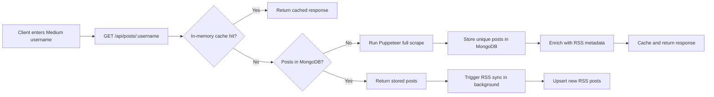

# Medium Blogs Retriever API

[](https://nodejs.org/)
[](https://react.dev/)
[](https://expressjs.com/)
[](https://www.mongodb.com/)
[](#license)

Medium Blogs Retriever API is a full-stack web application that turns any Medium username into a developer-friendly REST API. It fetches a writer's historical Medium posts, stores them in MongoDB, keeps them updated through RSS sync, and exposes the results through a clean React interface and JSON endpoint.

The first request for a new Medium user performs a full profile scrape with Puppeteer. Later requests are served from MongoDB and an in-memory cache, while background jobs keep known users in sync.

## Features

- Fetch posts for any Medium username through `GET /api/posts/:username`
- Scrape historical Medium profile posts using Puppeteer
- Enrich scraped posts with RSS metadata such as publish date, author, tags, excerpt, content, and thumbnail
- Store normalized post data in MongoDB with unique Medium post IDs
- Serve repeat requests quickly with a short-lived in-memory cache
- Trigger background RSS syncs for returning users
- Run a scheduled sync for all known users every 30 minutes
- Provide a React + Vite frontend for searching users, browsing posts, and copying API URLs
- Serve the built frontend from the Express server in production
- Include a health check endpoint for uptime monitors and keep-awake jobs

## Tech Stack

| Layer | Tools |
| --- | --- |
| Frontend | React, Vite, Tailwind CSS |
| Backend | Node.js, Express |
| Database | MongoDB, Mongoose |
| Scraping | Puppeteer |
| Caching | node-cache |
| Sync | Medium RSS feed parsing, scheduled background jobs |

## How It Works



## Project Structure

```text
medium-blogs-retriever-api/
|-- client/
|   |-- src/
|   |   |-- App.jsx
|   |   |-- index.css
|   |   `-- main.jsx
|   |-- index.html
|   |-- package.json
|   `-- vite.config.js
|-- server/
|   |-- config/
|   |   `-- dbConnection.js
|   |-- models/
|   |   `-- Post.js
|   |-- routes/
|   |   `-- posts.js
|   |-- services/
|   |   |-- mediumService.js
|   |   `-- scraperService.js
|   |-- utils/
|   |   |-- rssParser.js
|   |   `-- urlHelper.js
|   |-- index.js
|   `-- package.json
|-- .puppeteerrc.cjs
|-- package.json
`-- README.md
```

## Getting Started

### Prerequisites

- Node.js `18.0.0` or newer
- npm
- A MongoDB database, either local or hosted with MongoDB Atlas

### Installation

```bash
git clone https://github.com/aman-shahi-dev/medium-blogs-retriever-api.git
cd medium-blogs-retriever-api
npm run install-all
```

### Environment Variables

Create a `.env` file in the project root:

```env
MONGODB_URI=mongodb+srv://<username>:<password>@<cluster-url>/<database-name>
PORT=5000
NODE_ENV=development
```

| Variable | Required | Description |
| --- | --- | --- |
| `MONGODB_URI` | Yes | MongoDB connection string used by Mongoose |
| `PORT` | No | Server port. Defaults to `5000` |
| `NODE_ENV` | No | Use `production` when serving the built React app from Express |

### Run Locally

Start the backend:

```bash
node server/index.js
```

In another terminal, start the frontend:

```bash
npm run dev --prefix client
```

The frontend runs through Vite and proxies API calls to:

```text
http://localhost:5000
```

Open the Vite URL printed in your terminal, usually:

```text
http://localhost:5173
```

## Production Build

Build the React client and install the Chromium browser used by Puppeteer:

```bash
npm run build
```

Start the production server:

```bash
npm start
```

When `NODE_ENV=production`, Express serves the compiled React app from `client/dist` and keeps all API routes under `/api`.

## API Reference

### Health Check

```http
GET /api/ping
```

Response:

```json
{
  "status": "alive"
}
```

### Fetch Medium Posts

```http
GET /api/posts/:username
```

Example:

```http
GET /api/posts/amanshahidev
```

Successful response:

```json
{
  "success": true,
  "data": {
    "username": "amanshahidev",
    "postCount": 2,
    "posts": [
      {
        "_id": "65f000000000000000000000",
        "username": "amanshahidev",
        "postId": "abc123def456",
        "title": "Example Medium Article",
        "link": "https://medium.com/@amanshahidev/example-medium-article-abc123def456",
        "pubDate": "2026-07-01T00:00:00.000Z",
        "author": "Aman Shahi",
        "categories": ["javascript", "web-development"],
        "excerpt": "A short plain-text summary of the article...",
        "thumbnail": "https://miro.medium.com/...",
        "content": "<p>Original RSS HTML content...</p>",
        "createdAt": "2026-07-01T00:00:00.000Z",
        "updatedAt": "2026-07-01T00:00:00.000Z"
      }
    ]
  }
}
```

Error response:

```json
{
  "success": false,
  "message": "No posts found for user @username or user does not exist."
}
```

## Data Model

Each stored post contains:

| Field | Description |
| --- | --- |
| `username` | Normalized Medium username |
| `postId` | Unique Medium article ID extracted from the post URL |
| `title` | Article title |
| `link` | Canonical Medium article URL |
| `pubDate` | Publication date from RSS when available |
| `author` | Article author |
| `categories` | Medium tags/categories |
| `excerpt` | Plain-text excerpt generated from RSS content |
| `thumbnail` | First article image found in RSS content or profile scrape |
| `content` | HTML content returned by Medium RSS |

## Caching and Sync Strategy

The application uses three layers to balance speed and freshness:

1. In-memory cache: Responses are cached for 10 minutes with `node-cache`.
2. MongoDB persistence: Previously fetched users are served from the database immediately.
3. RSS refresh: Returning users trigger a background RSS sync so new posts are upserted without blocking the response.

A scheduled background job runs every 30 minutes and syncs all unique usernames already stored in the database.

## Deployment Notes

For platforms such as Render, Railway, Fly.io, or similar Node hosting providers:

- Set `MONGODB_URI` in the service environment variables.
- Set `NODE_ENV=production`.
- Use `npm run install-all` as the install command if the platform does not install nested packages automatically.
- Use `npm run build` as the build command.
- Use `npm start` as the start command.
- Make sure the runtime supports headless Chromium for Puppeteer.

The `.puppeteerrc.cjs` file stores Puppeteer's browser cache inside the project directory so the browser binary can persist across build and runtime phases on platforms that support persistent build artifacts.

## Troubleshooting

### MongoDB connection fails

Check that `MONGODB_URI` is present in the root `.env` file, the database user has the correct password, and your MongoDB Atlas network access settings allow the deployment host.

### First request takes time

This is expected for a new Medium username. The app has to open Medium with Puppeteer, scroll the profile, collect historical post links, store the results, and enrich them through RSS.

### Puppeteer fails in production

Confirm that Chromium was installed during the build step and that the host supports the launch flags used in `server/services/scraperService.js`.

### Medium returns incomplete results

Medium profiles use lazy loading and can change their page structure over time. The RSS sync layer helps keep recent posts accurate, but historical scraping may need selector updates if Medium changes its markup.

## Responsible Usage

This project is intended for learning, portfolio demonstration, and developer tooling. Respect Medium's terms, avoid aggressive request patterns, and do not use the API to copy or republish authors' content without permission.

## Author

Built by [Aman Shahi](https://github.com/aman-shahi-dev).

## License

This project is licensed under the ISC License.
